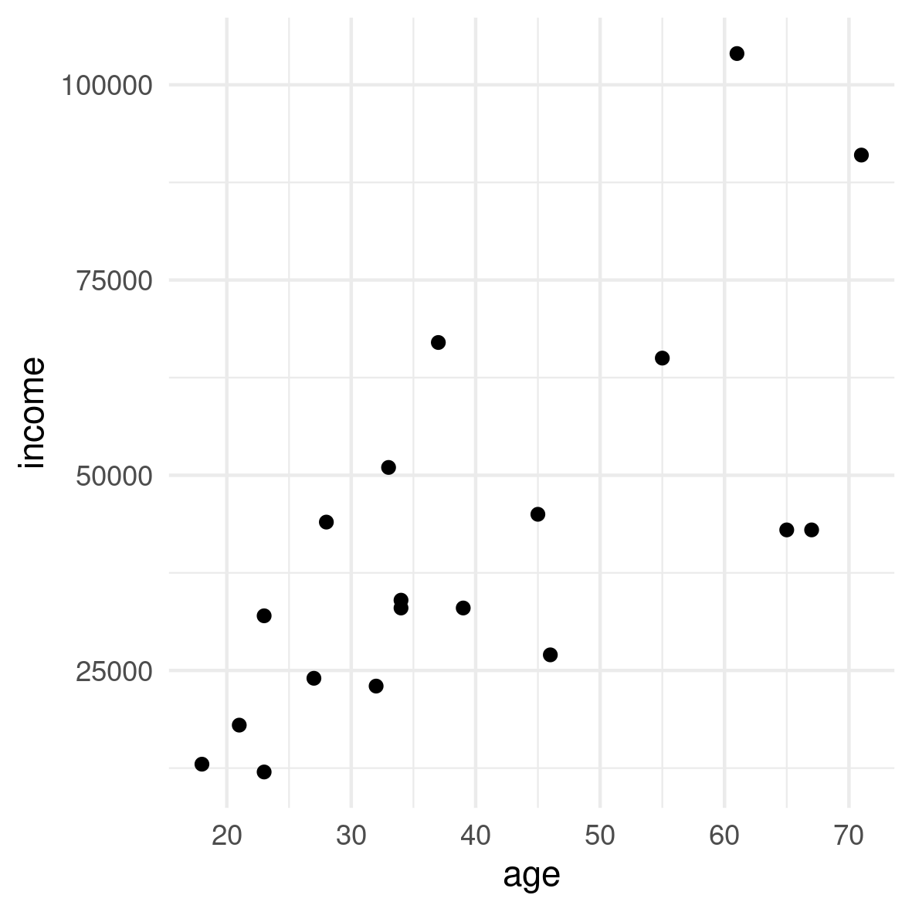

# An Example of an Output
This is an example where we pull on objects which we created previously in a sourced analysis file. And this is actually a quote [@andersson2004childbearing]. 

The original data set contained  `r N_all` individuals. We carried out an analysis of `r N_studypop` individuals. The mean income for this group was `r sprintf("%.2f",round(mean_inc,2))` units.

# A Figure Example 
That is the relation between income and age for the subset:

```{r fig.pos = 'H', echo = FALSE, out.width="50%"} 

```

Figure 1: `r plot_title `

# A Table Example 
And that's a table for the subset.

Table 1: `r table_studypop_title`

```{r allsev, echo = FALSE, results= 'asis'} 
knitr::kable(table_studypop)
```


# References 
